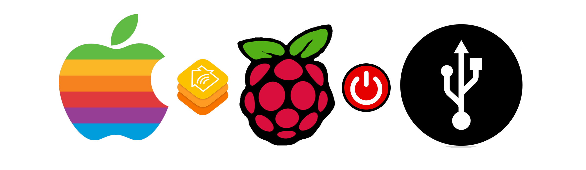

# How To Guide on controlling the USB power state on a <a rel="nofollow" href="https://www.amazon.co.uk/gp/product/B01CI5879A/ref=as_li_tl?ie=UTF8&camp=1634&creative=6738&creativeASIN=B01CI5879A&linkCode=as2&tag=httpgithcomsk-21">Raspberry Pi Model 3 B</a> with [Apple's Home App](http://www.apple.com/uk/ios/home/) using [Homebridge](https://github.com/nfarina/homebridge)




---

<div style="font-size:12pt;color:red;">Important: Turning off the USB power on the Raspberry Pi will also disable the Ethernet port, so this project is only suitable for people controlling a Raspberry Pi over WiFi!</div>

---

# Items needed for this project:

* 1x iOS 10 device running [Apple's Home App](http://www.apple.com/uk/ios/home/)
* 1x Raspberry Pi 3 Model B (you can buy them from: <a rel="nofollow" href="https://www.amazon.co.uk/gp/product/B01CI5879A/ref=as_li_tl?ie=UTF8&camp=1634&creative=6738&creativeASIN=B01CI5879A&linkCode=as2&tag=httpgithcomsk-21">LINK</a>)

---


# Setup Your Raspberry Pi & Install Homebridge.


#### Follow this step by step guide to install the HomeBridge service on your Raspberry PI which is used to connect/bridge your non-HomeKit accessories and make them HomeKit enabled

https://github.com/nfarina/homebridge/wiki/Running-HomeBridge-on-a-Raspberry-Pi

---

# Configuration.

#### Once Homebridge is setup copy the files to the Raspberry Pi.

* Download and place the *USBPowerOn.sh* & *USBPowerOff.sh* files in your /home/pi directory.


#### Configure Homebridge to create a switch to move the shades up and down.

  * Install the [Script2](https://github.com/pponce/homebridge-script2) homebridge plugin using the command:

        sudo npm install -g homebridge-script2

  * Configure the plugin to create a switch, on your Raspberry Pi go to your /home/pi/.homebridge folder and edit the *config.json* file


Add in the following code under the accessories section.

```
"accessories": [
{
  "accessory": "Script2",
  "name": "Pi USB",
  "on": "./USBPowerOn.sh",
  "off": "./USBPowerOff.sh",
  "fileState": "./script.flag",
  "on_value" : "true"
}
]
```

---

# Finish

#### Now that everything is installed and configured you should be able to run Homebridge on your Raspberry Pi with the command:

    homebridge

#### And if you did everything correctly a new Pi USB accessory switch will show up in your Home.app on your iOS device

#### Turning the Switch to Off will turn off the power for the Raspberry Pi's USB ports and turining it On turn the power back on.

---

### Guide created by SkyJohn on March 27th 2017

---

# Changelog

### 1.0.0
* How To Guide created.
